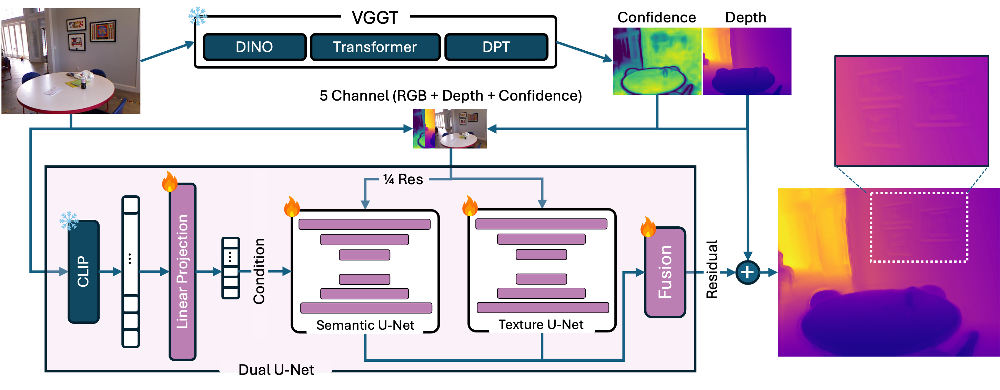

# Refining Zero-Shot Depth Predictions via Texture- and Semantic-Aware U-Nets

This repository contains the official code for our ETH CIL 2025 course project. We present **Dual U-Net**, a lightweight residual refinement network that enhances monocular depth predictions from zero-shot backbones such as [VGGT](https://github.com/facebookresearch/vggt).

Our model fuses complementary information from two branches:
- A **texture-aware U-Net** that captures fine-grained image structure
- A **semantic-aware U-Net** that incorporates global scene context via CLIP embeddings

These branches produce residual corrections over VGGT outputs, which are combined using a confidence-aware gating mechanism. The repository also includes implementations of classical filtering techniques (bilateral, joint bilateral, anisotropic diffusion) for comparison.

<p align="center">
  
</p>

---

## Setup

### Conda Environment

We recommend creating the environment using the provided YAML file:

```bash
conda env create -f environment.yml
conda activate monodepth
```

## Usage
All scripts are standalone and can be run directly from the root of the repository.
They expects ETHZ-CIL dataset under dataset directory which can be found in [Kaggle](https://www.kaggle.com/competitions/ethz-cil-monocular-depth-estimation-2025)

## Pretrained Model

You can download our pretrained Dual U-Net model from the [Drive link](https://drive.google.com/file/d/191x6BNy5NZ6b7H2NDzGZ0ELJ2VZHFO-K/view?usp=share_link).

## References

```bibtex

@misc{ethz-cil-monocular-depth-estimation-2025,
    author = {CIL Lecture},
    title = {ETHZ CIL Monocular Depth Estimation 2025},
    year = {2025},
    howpublished = {\url{https://kaggle.com/competitions/ethz-cil-monocular-depth-estimation-2025}},
    note = {Kaggle}
}

@inproceedings{vggt,
  title={VGGT: Visual Geometry Grounded Transformer},
  author={Wang, Jianyuan and Chen, Minghao and Karaev, Nikita and Vedaldi, Andrea and Rupprecht, Christian and Novotny, David},
  booktitle={Proceedings of the IEEE/CVF Conference on Computer Vision and Pattern Recognition},
  year={2025}
}
```